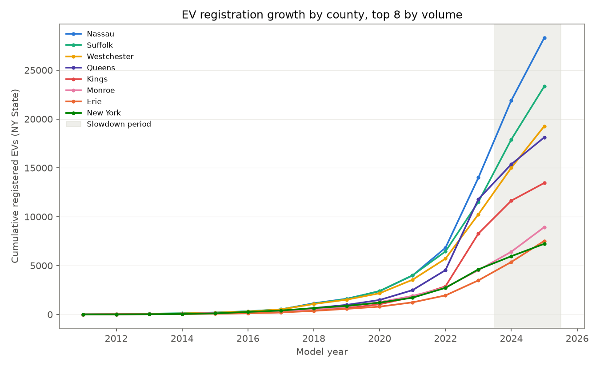
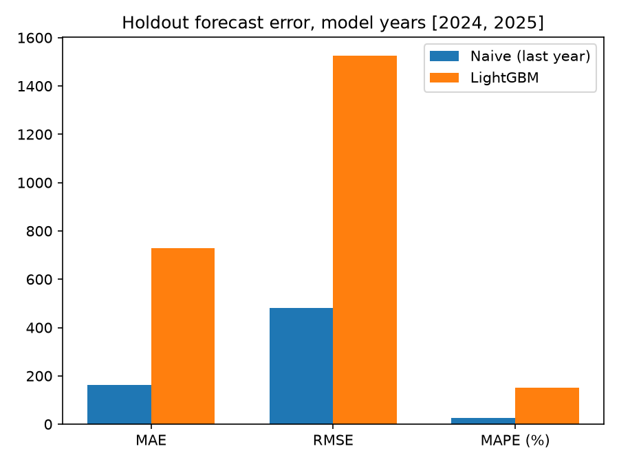
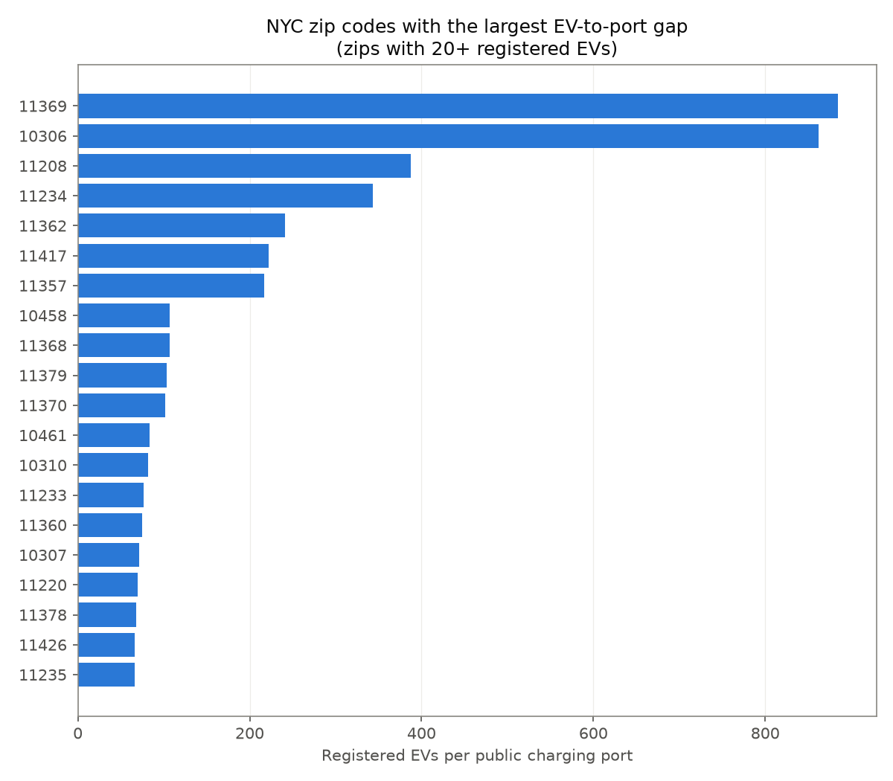

# Findings

Data pulled from data.ny.gov and the Census Gazetteer on 2026-07-06. Numbers below come
directly from `data/processed/summary.json` after running `run_pipeline.py`; re-running
the pipeline on a later date will pull fresher registration counts and may shift these
slightly.

## 1. Statewide EV adoption peaked in 2023 and has fallen for two years running

New registrations by model year, statewide:

| Model year | New registrations |
|---|---|
| 2021 | 11,795 |
| 2022 | 19,387 |
| 2023 | 48,411 |
| 2024 | 44,396 |
| 2025 | 38,046 |

Growth from 2021 to 2023 was roughly 4x. Then it reversed: 2024 came in 8% below 2023,
and 2025 came in another 14% below 2024. This isn't isolated to one or two counties -
it shows up across the largest EV markets in the state (Nassau, Suffolk, Queens,
Westchester all show the same flattening in the chart above).

## 2. That reversal is exactly where a trend-following model breaks

Two approaches were backtested on the 2024-2025 holdout, trained only on 2011-2023:

| Model | MAE | RMSE | MAPE |
|---|---|---|---|
| Naive (predict last year's count) | 162 | 481 | 25.9% |
| LightGBM (lag features + year index) | 730 | 1,526 | 151.8% |

The naive baseline wins by a wide margin, which looks backwards until you look at why.
Orange County is a clean example: registrations went 445 (2022) -> 925 (2023) -> 988
(2024), a strong upward run. LightGBM, trained on that run, predicted 5,919 for 2025.
The actual number was 791. The model wasn't picking up noise - it was doing exactly
what a gradient-boosted tree does with an accelerating trend, which is extrapolate it
forward. When 2025 broke the pattern instead of continuing it, that extrapolation
became the error. The naive model never assumed growth in the first place, so it had
nothing to unwind.

The practical takeaway: a forecasting model's backtest accuracy depends entirely on
whether the holdout period continues the training trend or breaks it. Reporting a
single accuracy number without stating which kind of period it was tested on is
misleading. Any utilization model built on a growth market (which EV charging is)
needs either a mechanism to detect regime changes or a wide enough confidence interval
to survive being wrong about one.

## 3. Where NYC's charging supply is furthest behind registered demand

Restricting to the five NYC counties and zip codes with at least 20 registered EVs,
ranked by registered EVs per public charging port (Level 1, 2, or DC fast combined):

| Zip | Borough (county) | Registered EVs per port |
|---|---|---|
| 11369 | Queens | ~890 |
| 10306 | Richmond | ~870 |
| 11208 | Kings | ~385 |
| 11234 | Kings | ~340 |
| 11362 | Queens | ~240 |

129 zip codes across the five NYC counties have 50 or more registered EVs and **zero**
DC fast charging ports. That list (`data/processed/nyc_zip_supply_demand.csv`,
filtered to `dcfc_ports == 0`) is a more direct answer to "where should a DCFC site go
next" than the ranking table above, since it separates "underserved" from "not served
at all."

## Caveats

- These are registration-based demand proxies, not measured utilization. See the
  README's Limitations section before treating any of these numbers as a substitute for
  real session-level data.
- The zip-level ranking does not yet account for zip land area, commute patterns, or
  proximity to highways - all of which affect where a DCFC site actually gets used
  versus just being near registered vehicles. That's the natural next iteration, and is
  closer to what the companion geographic ranking project in
  `dcfc-site-selection-model` starts to address with density and multi-factor scoring.
