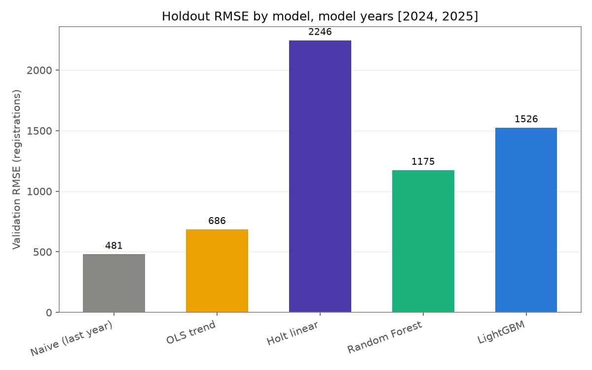
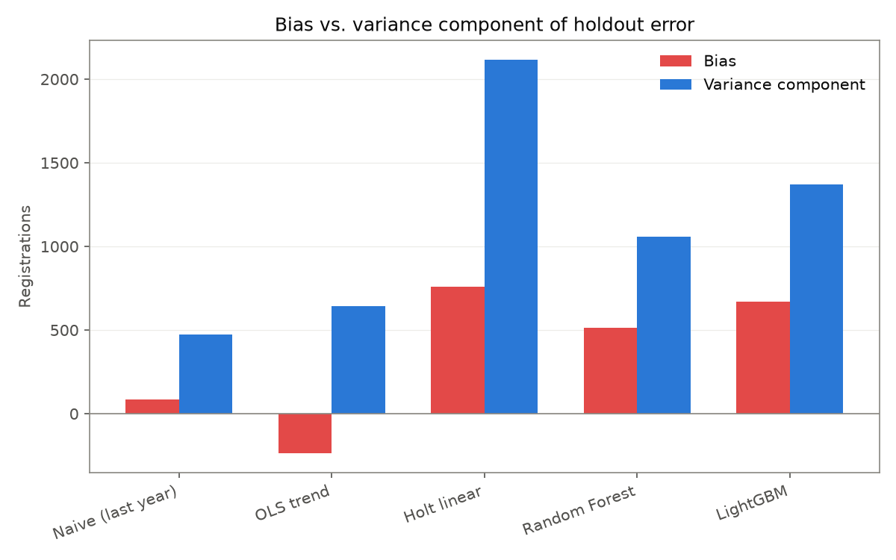
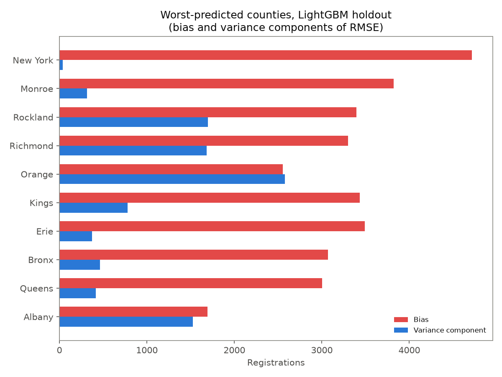
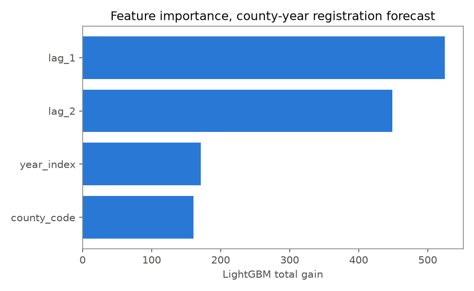

# Findings

Data pulled from data.ny.gov and the Census Gazetteer on 2026-07-06. Numbers below come
directly from `data/processed/summary.json` and `data/processed/lgbm_county_bias_variance.csv`
after running `run_pipeline.py`; re-running the pipeline on a later date will pull
fresher registration counts and may shift these slightly.

## 1. Statewide EV adoption peaked in 2023 and has fallen for two years running

New registrations by model year, statewide:

| Model year | New registrations |
|---|---|
| 2021 | 11,795 |
| 2022 | 19,387 |
| 2023 | 48,411 |
| 2024 | 44,396 |
| 2025 | 38,046 |

Growth from 2021 to 2023 was roughly 4x. Then it reversed: 2024 came in 8% below 2023,
and 2025 came in another 14% below 2024. This isn't isolated to one or two counties -
it shows up across the largest EV markets in the state (Nassau, Suffolk, Queens,
Westchester all show the same flattening in the chart above, shaded as the "slowdown
period").

## 2. Five models, one holdout, and a clean ordering by how much each one trusts the trend

All five models were trained only on 2011-2023 and evaluated on the 2024-2025 holdout:

| Model | RMSE | MAE | MAPE | Bias | Variance component |
|---|---|---|---|---|---|
| Naive (last year) | 481 | 162 | 25.9% | +84 | 474 |
| OLS trend | 686 | 264 | 35.4% | -236 | 644 |
| Random Forest | 1,175 | 601 | 115.0% | +514 | 1,056 |
| LightGBM | 1,526 | 730 | 151.8% | +669 | 1,371 |
| Holt linear | 2,246 | 759 | 91.2% | +757 | 2,115 |

This ordering is not random. It lines up almost exactly with how strongly each model's
inductive bias assumes the trend continues:

- **Naive** assumes zero trend - it predicts next year equals last year. When the trend
  broke, this model had nothing to unwind, so it wins by default.
- **OLS trend** fits one straight line per county across all of 2011-2023. It's a mild
  trend assumption, and it lands in between: worse than naive, better than everything
  that leans on more recent, steeper history.
- **Random Forest** and **LightGBM** split on lag features, so their extrapolation is
  bounded by leaf values seen in training - they overshoot, but not without limit.
- **Holt's linear exponential smoothing** explicitly extrapolates a locally-weighted
  trend line with no bound, and it does so using mostly the last few (fastest-growing)
  years. It has the worst RMSE (2,246) and the largest bias (+757): it was the most
  confident that 2024's growth would continue into 2025, and it was the most wrong.

Every model above naive is *positively* biased (over-predicts) except OLS, which
slightly under-predicts (-236) - a signal that a single county-wide line, fit across
the entire 2011-2023 window, is already pulled down by the early flat years enough to
partially offset the late acceleration it's also trying to fit.

## 3. Where the LightGBM model failed hardest

New York (Manhattan) county has the single worst LightGBM holdout error (RMSE 4,716)
and it is almost entirely bias, not variance (bias 4,716 vs. variance component only
40) - the model was consistently and confidently wrong in one direction on a
county with only two holdout points, which is as much a small-sample warning as a
modeling one. Orange and Rockland counties, by contrast, have their error split more
evenly between bias and variance, suggesting a noisier underlying trend rather than a
single systematic miss.

## 4. What actually drives the LightGBM forecast

By total gain, `lag_1` (last year's count) and `lag_2` (two years back) dominate,
together accounting for the large majority of the model's split gain. `year_index` and
`county_code` contribute much less. In other words, the model is mostly a
sophisticated way of looking at recent history - which is exactly why it, like Holt,
gets hurt when recent history stops being a reliable guide to what's next.

## 5. Where NYC's charging supply is furthest behind registered demand

Restricting to the five NYC counties and zip codes with at least 20 registered EVs,
ranked by registered EVs per public charging port (Level 1, 2, or DC fast combined):

| Zip | Borough (county) | Registered EVs per port |
|---|---|---|
| 11369 | Queens | ~890 |
| 10306 | Richmond | ~870 |
| 11208 | Kings | ~385 |
| 11234 | Kings | ~340 |
| 11362 | Queens | ~240 |

129 zip codes across the five NYC counties have 50 or more registered EVs and **zero**
DC fast charging ports. That list (`data/processed/nyc_zip_supply_demand.csv`,
filtered to `dcfc_ports == 0`) is a more direct answer to "where should a DCFC site go
next" than the ranking table above, since it separates "underserved" from "not served
at all."

## Caveats

- These are registration-based demand proxies, not measured utilization. See the
  README's Limitations section before treating any of these numbers as a substitute for
  real session-level data.
- Per-county holdout metrics are computed on just 2 data points (model years 2024 and
  2025) per county, so the worst-county ranking in Section 3 is illustrative of the
  failure mode, not a statistically robust ranking on its own.
- The zip-level ranking does not yet account for zip land area, commute patterns, or
  proximity to highways - all of which affect where a DCFC site actually gets used
  versus just being near registered vehicles. That's the natural next iteration, and is
  closer to what the companion geographic ranking project in
  `dcfc-site-selection-model` starts to address with density and multi-factor scoring.
